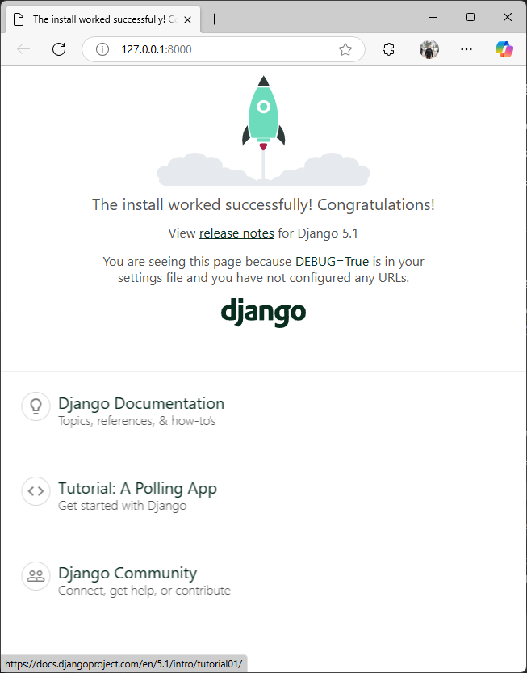

# Django Project

This is a simple **Django** project created to demonstrate a basic setup with a custom home page and application structure.

## 📌 Features
- Custom home page (`/`) with a simple text response or template rendering.
- Pre-configured admin panel.
- SQLite database for easy development and testing.

## 🛠 Installation

### 1️⃣ Clone the repository:
```bash
git clone https://github.com/TamerOnLine/.django.git
cd .django
```

### 2️⃣ Create a virtual environment:
```bash
python -m venv venv
source venv/bin/activate  # On macOS/Linux
venv\Scripts\activate  # On Windows
```

### 3️⃣ Install dependencies:
```bash
pip install -r requirements.txt
```

### 4️⃣ Apply migrations:
```bash
python src/manage.py migrate
```

### 5️⃣ Run the server:
```bash
python src/manage.py runserver
```

- Access the app at [http://127.0.0.1:8000](http://127.0.0.1:8000).

## 🖼 Screenshots


## 📄 License
This project is licensed under the **MIT License** - see the [LICENSE](LICENSE) file for details.

## 🤝 Contributing
Feel free to fork the repository and submit pull requests if you have any improvements!

## 📬 Contact
For any inquiries, you can reach me at: **info@tameronline.com**